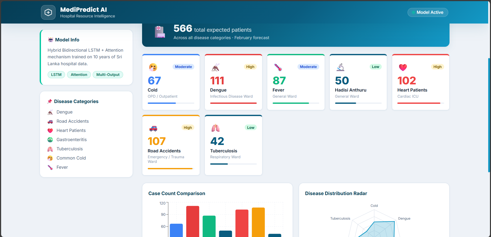

# 🏥 Hospital Resource Management with AI — Backend

<div align="center">


**An AI-powered hospital resource planning system that predicts monthly disease case counts using a Hybrid Bidirectional LSTM + Attention Neural Network, served through a Flask REST API backed by a MariaDB/MySQL database.**

</div>

---

## 📌 Table of Contents

- [Overview](#-overview)
- [AI & Deep Learning Architecture](#-ai--deep-learning-architecture)
- [Predicted Output](#-predicted-output)
- [Tech Stack](#-tech-stack)
- [Project Structure](#-project-structure)
- [Database Schema](#-database-schema)
- [API Endpoints](#-api-endpoints)
- [Setup & Run](#-setup--run)

---

## 🔍 Overview

This system predicts monthly hospital case counts for **7 disease categories** in Sri Lanka using 10 years of historical data. It enables hospital administrators to:

- Forecast patient load **1 month ahead**
- Allocate medical resources (beds, ICU, staff) proactively
- Analyze environmental and social factors affecting disease spread

---

## 🤖 AI & Deep Learning Architecture

### Model Type: Hybrid Bidirectional LSTM + Attention Neural Network

This is a **multi-output deep learning model** that simultaneously predicts case counts for 7 diseases. It combines multiple AI architectures for maximum accuracy:

```
Sequential Input (12 months × 10 features)
        │
        ▼
┌─────────────────────────────────┐
│  Bidirectional LSTM Layer 1     │  ← Learns temporal patterns in BOTH directions
│  (captures past & future context)│
└─────────────────────────────────┘
        │
        ▼
┌─────────────────────────────────┐
│  Bidirectional LSTM Layer 2     │  ← Deeper temporal feature extraction
└─────────────────────────────────┘
        │
        ▼
┌─────────────────────────────────┐
│  Custom Attention Layer         │  ← Focuses on most important time steps
│  (self-attention mechanism)     │
└─────────────────────────────────┘
        │
        ├──────────────────────────────────────────┐
        │                                          │
Static Input (5 features)                         │
        │                                          │
        ▼                                          │
┌─────────────────────────┐                        │
│  Dense ANN Branch       │                        │
│  (month, festivals,     │                        │
│   awareness level)      │                        │
└─────────────────────────┘                        │
        │                                          │
        └──────────┬───────────────────────────────┘
                   │
                   ▼
        ┌────────────────────┐
        │   Fusion Layer     │  ← Concatenates LSTM + ANN outputs
        │   (Dense ANN)      │
        └────────────────────┘
                   │
                   ▼
        ┌────────────────────────────────────┐
        │  Multi-Output Layer (7 neurons)    │
        │  Dengue | Road Accidents | Heart   │
        │  Gastro | TB | Cold | Fever        │
        └────────────────────────────────────┘
```

### 🧠 AI Components

| Component | Technology | Purpose |
|-----------|-----------|---------|
| **Recurrent Neural Network** | Bidirectional LSTM | Captures time-series patterns across 12-month sliding windows |
| **Attention Mechanism** | Custom Self-Attention Layer | Weights important months (e.g., monsoon seasons) more heavily |
| **Artificial Neural Network** | Dense Layers (ANN) | Processes static inputs: month encoding, festival flags, awareness level |
| **Fusion Architecture** | Concatenation + Dense | Merges sequential and static branches for combined prediction |
| **Regularization** | Dropout + L2 + Batch Normalization | Prevents overfitting on limited hospital data |
| **Loss Function** | Huber Loss | Robust to outlier case count spikes during epidemics |
| **Hyperparameter Tuning** | Keras Tuner (Bayesian Optimization) | Automatically finds optimal LSTM units, dropout rates, learning rate |

### 📥 Input Features

**Sequential Input** — 12-month window (time series):
| Feature | Description |
|---------|-------------|
| Dengue, Road_Accidents, Heart_Patients, Hadisi_Anthuru, Tuberculosis, Cold, Fever | Past case counts (7 diseases) |
| Rainfall | Monthly rainfall in mm |
| Avg_Temperature | Average temperature in °C |
| Humidity | Relative humidity % |

**Static Input** — Current month context:
| Feature | Description |
|---------|-------------|
| Month_Sin, Month_Cos | Cyclical month encoding (captures seasonality) |
| Festive_Season | Binary: public festivals active |
| Public_Holidays | Binary: public holidays |
| Public_Awareness_Level | Float 0–1: health campaign intensity |

### 📤 Output — 7 Disease Predictions
`Dengue` · `Road_Accidents` · `Heart_Patients` · `Hadisi_Anthuru` · `Tuberculosis` · `Cold` · `Fever`

---

## 📊 Predicted Output



> The model predicts monthly case counts across all 7 disease categories. The chart above shows model predictions vs actual values on the test set, demonstrating the accuracy of the Hybrid LSTM-Attention architecture.

---

## 🛠 Tech Stack

### Backend & AI
| Technology | Version | Role |
|-----------|---------|------|
| **Python** | 3.12 | Core language |
| **TensorFlow / Keras** | 2.20 | Deep learning framework (LSTM, ANN, Attention) |
| **Keras Tuner** | Latest | Bayesian hyperparameter optimization |
| **Flask** | 3.1 | REST API server |
| **Flask-CORS** | 6.0 | Cross-origin resource sharing for React frontend |
| **NumPy** | Latest | Numerical computations |
| **Pandas** | Latest | Data preprocessing |
| **Scikit-learn** | Latest | MinMaxScaler for feature normalization |
| **Joblib** | Latest | Scaler serialization |
| **PyMySQL** | Latest | MariaDB/MySQL database connector |

### Database
| Technology | Version | Role |
|-----------|---------|------|
| **XAMPP** | 8.2.12 | Local server stack (Apache + MariaDB) |
| **MariaDB / MySQL** | 10.4 | Relational database (hospital_db) |
| **phpMyAdmin** | Bundled | Database GUI administration |

---

## 📁 Project Structure

```
New folder/
├── app.py                          # Flask REST API — main server
├── generate_scalers.py             # Regenerates MinMaxScaler .joblib files
├── setup_database.py               # Creates MySQL schema & imports CSV data
├── hospital_multi_disease_final.csv # 10-year training dataset (120 months)
├── hospital_multi_output_model.keras # Trained Keras model (recommended format)
├── hospital_multi_output_model.h5   # Trained Keras model (legacy format)
├── scaler_seq.joblib               # Sequential feature scaler
├── scaler_static.joblib            # Static feature scaler
├── scaler_target.joblib            # Target (output) scaler
├── model_metadata.json             # Model info, hyperparameters, metrics
├── predicted_data.png              # Model prediction visualization
├── Untitled.ipynb                  # Training notebook (model development)
└── final_tuning/                   # Keras Tuner hyperparameter search results
    ├── multi_output/
    └── professional_multi_output/
```

---

## 🗄 Database Schema

**Database:** `hospital_db` (MariaDB via XAMPP)

```
hospital_db
├── time_periods
│   ├── id (PK)
│   ├── date (YYYY-MM-01)
│   ├── year, month
│   └── month_sin, month_cos   ← Cyclical encoding
│
├── environmental_factors
│   ├── id (PK), period_id (FK→time_periods)
│   ├── rainfall (mm)
│   ├── avg_temperature (°C)
│   └── humidity (%)
│
├── social_indicators
│   ├── id (PK), period_id (FK→time_periods)
│   ├── festive_season (0/1)
│   ├── public_holidays (0/1)
│   └── public_awareness_level (0.0–1.0)
│
└── disease_cases
    ├── id (PK), period_id (FK→time_periods)
    ├── dengue
    ├── road_accidents
    ├── heart_patients
    ├── hadisi_anthuru
    ├── tuberculosis
    ├── cold
    └── fever
```

---

## 🌐 API Endpoints

| Method | Endpoint | Description |
|--------|----------|-------------|
| `GET` | `/` | Health check — model & server status |
| `GET` | `/model-info` | Model metadata, feature names, window size |
| `GET` | `/history?month=<1-12>` | Average historical case counts for a given month from DB |
| `POST` | `/predict` | Raw prediction (sequential + static arrays) |
| `POST` | `/predict-frontend` | Simplified prediction for React frontend |

### `POST /predict-frontend` — Request Body
```json
{
  "month": 3,
  "humidity": 78.5,
  "rainfall": 118.2,
  "temperature": 29.4,
  "festive": 0,
  "awareness": 0.82
}
```

### `POST /predict-frontend` — Response
```json
{
  "status": "success",
  "predictions": {
    "Dengue": 123,
    "Road_Accidents": 62,
    "Heart_Patients": 98,
    "Hadisi_Anthuru": 41,
    "Tuberculosis": 46,
    "Cold": 61,
    "Fever": 80
  },
  "total_expected_patients": 511,
  "recommendation": [
    "✅ Normal patient load expected"
  ]
}
```

---

## 🚀 Setup & Run

### Prerequisites
- [Anaconda](https://www.anaconda.com/) with `tf_env` conda environment (TensorFlow 2.20)
- [XAMPP](https://www.apachefriends.org/) with MariaDB running

### 1 — Start MySQL (XAMPP)
Open XAMPP Control Panel → click **Start** next to **MySQL**

### 2 — Setup Database (first time only)
```bash
conda activate tf_env
cd "C:\Users\ASUS\Desktop\hospital\New folder"
python setup_database.py
```

### 3 — Regenerate Scalers (if missing)
```bash
python generate_scalers.py
```

### 4 — Start Flask API
```bash
python app.py
```

Expected output:
```
✅ Database connected successfully!
Model loaded: Hospital Multi-Disease Prediction Model v2.0
✅ All assets loaded successfully!
 * Running on http://0.0.0.0:5000
```

### 5 — Start React Frontend (separate terminal)
```bash
cd "C:\Users\ASUS\Desktop\hospital\hospital-frontend"
npm run dev
```

Open **http://localhost:5173** in your browser.

---

## 🔬 Model Training

The model was trained using the Jupyter notebook `Untitled.ipynb` with:
- **15 Bayesian optimization trials** via Keras Tuner
- **100 epochs** per trial with early stopping (patience=15)
- **80/20 train/test split**
- **12-month sliding window** for sequential input
- **Huber loss** for robustness against case count spikes

---

<div align="center">
  <sub>Built with ❤️ for Sri Lanka Hospital Resource Intelligence</sub>
</div>
